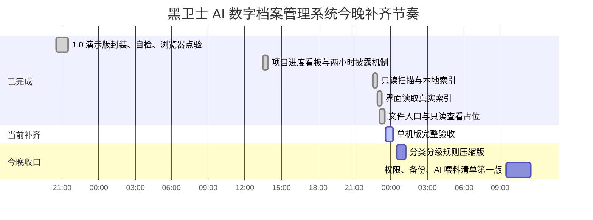

# 黑卫士 AI 数字档案管理系统项目进度看板

更新时间：2026-06-22 23:10

当前总状态：1.0 可安装/可演示版稳定，自检通过。单机可用版已补上只读扫描、本地索引、界面读取真实索引和文件入口；当前项目目录已生成 16 条真实文件索引。下一步做单机版完整验收。

## 甘特图

## 总进度

| 阶段 | 目标 | 状态 | 完成度 | 计划时间 | 验收方式 |
|---|---|---:|---:|---|---|
| 1.0 可安装/可演示版 | 能启动、能演示、能检索、能自检 | 已完成 | 100% | 已完成 | `npm test` 通过，浏览器点验通过 |
| 单机可用版冲刺 | 扫描真实文件夹，生成本地索引，界面读取真实数据 | 验收中 | 80% | 2026-06-22 晚间 | 已生成 16 条真实文件索引，页面已读取，文件入口可交互 |
| 分类分级规则压缩版 | 建立公司、部门、项目、作者、作品类型、密级规则 | 今晚排队 | 0% | 2026-06-22 深夜 | 字段表稳定，样本数据能归类 |
| 权限与备份压缩版 | 区分查看、复制、下载、修改、删除权限，建立备份快照 | 明早推进 | 0% | 2026-06-23 上午 | 权限矩阵和备份目录可演示 |
| AI 准备第一版 | OCR、录音转写、视频抽帧、AI 喂料清单 | 明早推进 | 0% | 2026-06-23 上午 | 有可执行任务清单和禁训清单 |

## 1 天单机可用版细分进度

| 编号 | 工作项 | 交付物 | 状态 | 完成度 | 我完成后更新 |
|---|---|---|---:|---:|---|
| L1 | 确定样本档案目录 | 一个本机文件夹路径 | 已完成 | 100% | 先用当前项目目录作为样本闭环 |
| L2 | 只读扫描文件 | 文件名、路径、大小、格式、修改时间 | 已完成 | 100% | 已扫描 16 个文件，总量 161KB |
| L3 | 生成本地索引 | `archive-index.json` 和页面数据文件 | 已完成 | 100% | 已生成 `界面原型-v1/archive-index.json` |
| L4 | 界面接入真实索引 | 当前表格显示真实文件 | 已完成 | 100% | 浏览器显示 16 条本机索引 |
| L5 | 文件操作入口 | 复制路径、打开所在位置申请占位 | 已完成 | 100% | 浏览器点验通过，剪贴板不可用时可手动复制路径 |
| L6 | 基础分类规则 | 按公司、部门、项目、类型、格式初步归类 | 今晚排队 | 0% | 写入规则覆盖率 |
| L7 | 单机版验收 | 一次完整演示路线 | 验收中 | 40% | 已验证真实索引和文件入口，待完整演示路线 |

## 更新规则

- 每完成一个工作项，我会把状态更新为“已完成”，并补充完成度和验收结果。
- 如果遇到需要你确认的地方，我会把状态标为“待确认”，并写清楚只需要你确认什么。
- 每次阶段完成后，我会保留上一版，不直接覆盖关键决策。
- 当前节奏：先用最短路径跑通单机闭环。没有样本目录确认时，先用当前项目目录做技术闭环，不移动、不删除真实文件。
