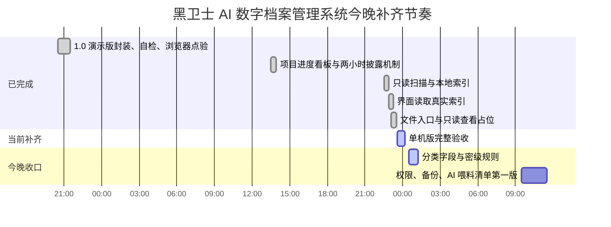

# 黑卫士 AI 数字档案管理系统项目进度看板

更新时间：2026-06-23 00:30

当前总状态：1.0 可安装/可演示版稳定，自检通过。单机可用版已补上只读扫描、本地索引、界面读取真实索引、文件入口、本机索引快搜、一键演示、分类字段、L0-L6 密级、作品完整状态和作品等级规则。当前总进度为 89.0%，蓝色跳动表示正常推进，绿色表示超前或提前完成，红色表示暂停或等待真实硬盘接入。

## 甘特图

## 总进度

| 阶段 | 目标 | 状态 | 完成度 | 计划时间 | 验收方式 |
|---|---|---:|---:|---|---|
| 1.0 可安装/可演示版 | 能启动、能演示、能检索、能自检 | 已完成 | 100.0% 绿色 | 已完成 | `npm test` 通过，浏览器点验通过 |
| 单机可用版冲刺 | 扫描真实文件夹，生成本地索引，界面读取真实数据 | 验收中 | 89.0% 蓝色跳动 | 2026-06-23 凌晨 | 已生成真实文件索引，页面已读取，文件入口可交互 |
| 分类字段与密级规则 | 建立公司类型、公司名称、部门建制、项目类型、作者、负责人等级、周期阶段、作品等级、L0-L6 密级 | 验收中 | 89.0% 蓝色跳动 | 2026-06-23 凌晨 | 字段写入界面、扫描脚本和验收脚本 |
| 真实硬盘全量接入 | 接真实硬盘或样本目录，分批扫描 40T-60T 数据 | 待接入 | 00.0% 红色 | 待选择目录 | 不移动、不删除、不改名真实文件 |
| AI 准备第一版 | OCR、录音转写、视频抽帧、AI 喂料清单 | 明早推进 | 00.0% 红色 | 2026-06-23 上午 | 有可执行任务清单和禁训清单 |

## 1 天单机可用版细分进度

| 编号 | 工作项 | 交付物 | 状态 | 完成度 | 我完成后更新 |
|---|---|---|---:|---:|---|
| L1 | 确定样本档案目录 | 一个本机文件夹路径 | 已完成 | 100% | 先用当前项目目录作为样本闭环 |
| L2 | 只读扫描文件 | 文件名、路径、大小、格式、修改时间 | 已完成 | 100% | 已扫描 16 个文件，总量 161KB |
| L3 | 生成本地索引 | `archive-index.json` 和页面数据文件 | 已完成 | 100% | 已生成 `界面原型-v1/archive-index.json` |
| L4 | 界面接入真实索引 | 当前表格显示真实文件 | 已完成 | 100% | 浏览器显示 16 条本机索引 |
| L5 | 文件操作入口 | 复制路径、打开所在位置申请占位 | 已完成 | 100% | 浏览器点验通过，剪贴板不可用时可手动复制路径 |
| L6 | 分类字段与密级规则 | 公司类型、部门建制、周期阶段、作品等级、L0-L6 密级 | 验收中 | 89.0% | 已写入界面字段、扫描脚本和验收标准，待重新扫描确认 |
| L7 | 单机版验收 | 一次完整演示路线 | 验收中 | 89.0% | 已验证真实索引、文件入口、本机快搜和分类字段，待重新跑完整验收 |

## 更新规则

- 每完成一个工作项，我会把状态更新为“已完成”，并补充完成度和验收结果。
- 标题后面的百分比状态牌规则：蓝色跳动代表正常推进，绿色代表超前或提前完成，红色代表暂停或等待真实硬盘接入。
- 如果遇到需要你确认的地方，我会把状态标为“待确认”，并写清楚只需要你确认什么。
- 每次阶段完成后，我会保留上一版，不直接覆盖关键决策。
- 当前节奏：先用最短路径跑通单机闭环。没有样本目录确认时，先用当前项目目录做技术闭环，不移动、不删除真实文件。
