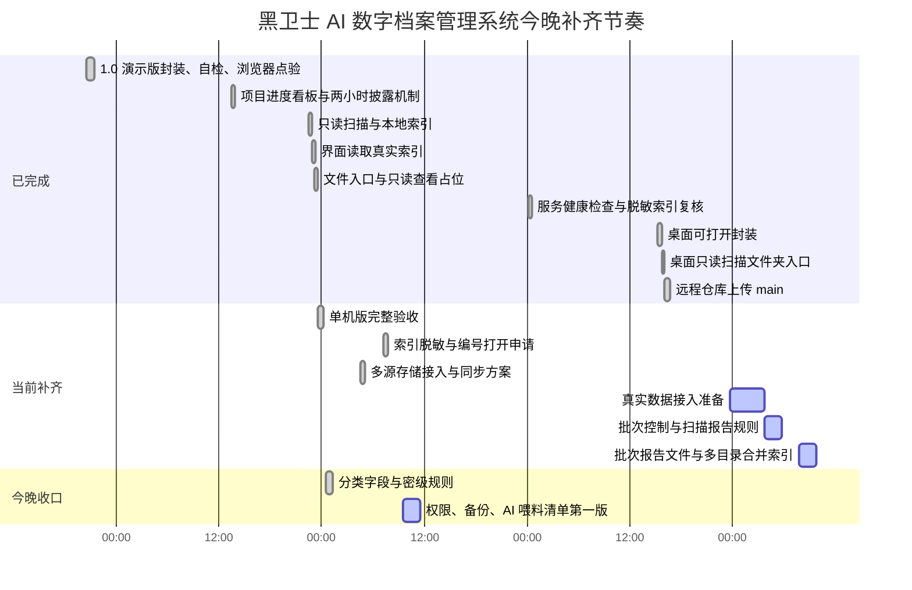

# 黑卫士 AI 数字档案管理系统项目进度看板

更新时间：2026-06-25 07:47

当前总状态：1.0 可安装/可演示版稳定，自检通过。单机可用版闭环已完成：只读扫描、本地索引、浏览器脱敏索引、按档案编号申请打开所在位置、本机索引快搜、一键演示、服务健康检查、桌面主系统入口、桌面进度看板入口、桌面只读扫描文件夹入口、桌面项目文件入口、远程仓库上传、分类字段、L0-L6 密级、作品完整状态和作品等级规则均已验收。多源存储来源、同步策略、交叉校验已纳入字段和方案。当前演示/单机/桌面封装/远程仓库阶段完成度为 100.0%。真实数据接入准备已补入界面批次控制、SOP、批次报告文件和多目录合并索引基础能力，完成度提升为 75.0%；真实 40T-60T 全量接入仍为 00.0%，等待真实硬盘、NAS、手机、云盘或样本目录。

## 甘特图

## 总进度

| 阶段 | 目标 | 状态 | 完成度 | 计划时间 | 验收方式 |
|---|---|---:|---:|---|---|
| 1.0 可安装/可演示版 | 能启动、能演示、能检索、能自检、能做服务健康检查 | 已完成 | 100.0% 绿色 | 已完成 | `npm test`、`npm run health` 通过，首页和看板可访问 |
| 单机可用版冲刺 | 扫描样本文件夹，生成本地索引，界面读取真实数据 | 已完成 | 100.0% 绿色 | 2026-06-23 07:42 | 已生成脱敏浏览器索引，服务端保留私有路径，文件入口按编号申请打开 |
| 分类字段与密级规则 | 建立公司类型、公司名称、部门建制、项目类型、作者、负责人等级、周期阶段、作品等级、L0-L6 密级 | 已完成 | 100.0% 绿色 | 2026-06-23 07:42 | 字段写入界面、扫描脚本和验收脚本 |
| 多源存储接入与同步方案 | 纳入本地目录、外接硬盘、NAS/网盘、手机/iPad、SD卡/相机、邮箱、云盘等来源，明确增量同步、只读扫描、去重和交叉校验策略 | 已完成第一版 | 100.0% 绿色 | 2026-06-23 07:42 | 多源来源、同步策略、交叉校验已纳入字段和方案 |
| 桌面可打开封装 | 桌面双击打开主系统、进度看板、只读扫描文件夹和项目文件入口 | 已完成 | 100.0% 绿色 | 2026-06-24 15:43 | 三个 `.command` 入口可自动启动、打开看板或选择目录只读扫描，项目文件入口指向原项目目录 |
| 远程仓库上传 | 上传到 GitHub 远程仓库并建立 main 分支跟踪 | 已完成 | 100.0% 绿色 | 2026-06-24 16:20 | 已推送到 `okalexhohongkong/aiDigitalArchives`，提交号 `32472d3` |
| 真实数据接入准备 | 补齐真实硬盘、NAS、手机、云盘、邮箱、U盘、SD卡、相机等来源的批次和报告流程 | 正在推进 | 75.0% 蓝色 | 2026-06-25 早间 | 批次报告文件、浏览器脱敏批次摘要、多目录合并索引基础能力已跑通；下一步补批次历史看板和真实介质样本验证 |
| 真实硬盘全量接入 | 接真实硬盘或样本目录，分批扫描 40T-60T 数据 | 待接入 | 00.0% 红色 | 待选择目录 | 不移动、不删除、不改名真实文件 |
| AI 准备第一版 | OCR、录音转写、视频抽帧、AI 喂料清单 | 排队推进 | 00.0% 红色 | 真实样本接入后 | 有可执行任务清单和禁训清单 |

## 1 天单机可用版细分进度

| 编号 | 工作项 | 交付物 | 状态 | 完成度 | 我完成后更新 |
|---|---|---|---:|---:|---|
| L1 | 确定样本档案目录 | 一个本机文件夹路径 | 已完成 | 100% | 先用当前项目目录作为样本闭环 |
| L2 | 只读扫描文件 | 文件名、私有路径、相对路径、大小、格式、修改时间 | 已完成 | 100% | 已扫描 28 个文件，总量 302KB |
| L3 | 生成本地索引 | `archive-index.json` 和页面数据文件 | 已完成 | 100% | 已生成 `界面原型-v1/archive-index.json` |
| L4 | 界面接入真实索引 | 当前表格显示真实文件 | 已完成 | 100% | 浏览器索引已脱敏，页面显示 28 条本机索引 |
| L5 | 文件操作入口 | 复制相对路径、按档案编号申请打开所在位置 | 已完成 | 100% | 服务端按档案编号核验后打开，不在浏览器数据中暴露完整路径 |
| L6 | 分类字段与密级规则 | 公司类型、部门建制、周期阶段、作品等级、L0-L6 密级 | 已完成 | 100% | 已写入界面字段、扫描脚本和验收标准，已重新扫描确认 |
| L7 | 单机版验收 | 一次完整演示路线 | 已完成 | 100% | `npm run verify`、`npm test`、`npm run backup` 均通过 |
| L8 | 多源存储接入与同步方案 | 多源来源字段、同步策略、交叉校验规则 | 已完成第一版 | 100% | 已把本地目录、外接硬盘、NAS/网盘、手机/iPad、SD卡/相机、邮箱、云盘等来源纳入方案；真实 40T-60T 全量接入仍等待指定目录/硬盘 |
| L9 | 服务健康检查 | 首页、看板、健康接口、浏览器脱敏索引 | 已完成 | 100% | `npm run health` 通过，可快速判断服务是否正常 |
| L10 | 桌面可打开封装 | 主系统入口、进度看板入口、只读扫描文件夹入口、项目文件入口 | 已完成 | 100% | 桌面入口已生成，并加入启动锁避免重复启动服务；只读扫描入口可选择文件夹后更新索引、验收和备份 |
| L11 | 远程仓库上传 | GitHub main 分支 | 已完成 | 100% | 已推送 `32472d3 Initial demo version`，远程仓库为 `okalexhohongkong/aiDigitalArchives` |
| L12 | 真实数据接入准备 | 批次、来源、密级提醒、扫描报告流程 | 正在推进 | 75% | 批次报告文件和多目录合并索引已跑通；下一步做批次历史看板和真实介质样本验证 |

## 并行模块总控表

| 模块线 | 当前责任 | 交付物 | 状态 | 合并验收 |
|---|---|---|---:|---|
| A 接入/索引线 | 多源来源识别、只读扫描、索引字段 | 扫描脚本、索引 JSON、验收报告 | 已完成 100.0% | 语法检查、重新扫描、验收报告通过 |
| B 界面/检索线 | 检索入口、字段展示、预览元数据 | 主界面、高级检索、表格字段、预览标签 | 已完成 100.0% | 浏览器脱敏索引可读取，关键词筛选待最终可视点验 |
| C 权限/备份线 | 密级边界、备份快照、禁止误操作 | L0-L6、备份脚本、只读原则、路径脱敏、健康检查 | 已完成 100.0% | 自检、健康检查、备份快照通过 |
| D AI 收尾/SOP线 | 半成品收尾、禁训清单、真实接入流程 | SOP、交付清单、多源存储方案 | 已完成第一版 100.0% | 文档检查通过，后续等真实素材细化 |
| E 看板/总控线 | 四小时战报、甘特图、停顿提醒 | 进度看板、Markdown 甘特图、百分比徽章 | 已同步 100.0% | 看板页面和文字版同步 |
| G 桌面封装线 | 双击打开、服务复用、只读扫描、项目文件入口 | 桌面 `.command` 入口、项目文件快捷入口、启动锁 | 已完成 100.0% | 主系统、看板和只读扫描入口均可使用 |
| H 远程仓库线 | 版本提交、远程推送、SSH 推送稳定性 | GitHub main 分支、本仓库 SSH 别名 | 已完成 100.0% | `git push` 已验证 |
| I 真实接入准备线 | 来源批次、扫描前确认、接入报告 | 批次报告、脱敏批次摘要、多目录合并索引 | 正在推进 75.0% | 下一步做批次历史看板和真实介质样本验证 |
| F 真实全量接入线 | 40T-60T 真实硬盘分批接入 | 真实目录索引、差异对账、风险报告 | 待接入 00.0% | 等待真实目录或硬盘 |

并行规则：不同模块可以同时写，最后统一合并到主界面、SOP、验收报告和看板。任何真实停顿、阻塞、测试失败或依赖缺失，都要用中文主动提醒；没有阻塞时继续推进，不等待用户确认。

## 更新规则

- 每完成一个工作项，我会把状态更新为“已完成”，并补充完成度和验收结果。
- 标题后面的百分比状态牌规则：蓝色跳动代表正常推进，绿色代表超前或提前完成，红色代表暂停或等待真实硬盘接入。
- 如果遇到需要你确认的地方，我会把状态标为“待确认”，并写清楚只需要你确认什么。
- 每次阶段完成后，我会保留上一版，不直接覆盖关键决策。
- 当前节奏：先用最短路径跑通单机闭环。没有样本目录确认时，先用当前项目目录做技术闭环，不移动、不删除真实文件。
