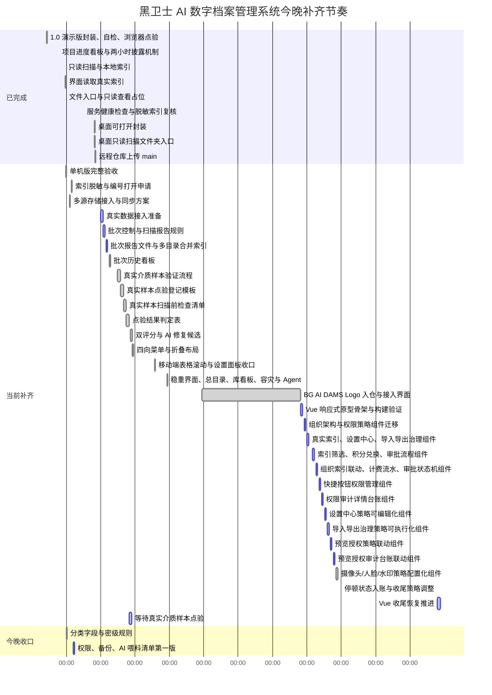

# 黑卫士 AI 数字档案管理系统项目进度看板

更新时间：2026-07-14 14:02

当前总状态：1.0 可安装/可演示版仍可用，远程私有镜像仓 `Alex-Code-Repository` 与本地仓保持同步。`BG AI DAMS` 品牌 Logo 已完成并接入当前界面。Vue 响应式重构账面保持 74.0%，已新增摄像头/人脸/水印策略配置化、策略台账、模拟切换、仅模拟策略不调用摄像头/人脸识别、预览授权审计联动、仅记录模拟审计不触碰真实文件、预览授权策略联动、授权前置条件、预览安全边界、预览授权台账、导入导出治理策略可执行化、执行步骤、审批门禁、治理台账、设置中心策略可编辑化、审计详情台账、快捷按钮权限管理、组织架构与真实脱敏索引联动、查询计费流水、审批状态机、390px 移动端回归，当前可通过 `http://127.0.0.1:4173/界面原型-vue/dist/index.html` 打开。必须如实提醒：停顿未解除，主仓最后一次真实开发提交仍为 `d442033`（2026-07-08 17:08），镜像仓最后一次提交仍为 `555f450`（2026-07-08 17:09），本次仅更新看板真实状态。真实数据接入准备仍为 96.0%，真实 40T-60T 全量接入仍为 00.0%，等待真实硬盘、NAS、手机、云盘或样本目录。旧版 `app.js` 为 4323 行、`styles.css` 为 5324 行，仍超过 1500 行规范；接下来 48 小时冻结非关键新功能，优先 Vue 收尾和真实接入清单。

## 最新推进记录

| 时间 | 事项 | 状态 | 说明 |
|---|---|---:|---|
| 2026-06-30 | 新远程镜像仓 | 已完成 | 本地与远程统一为 `Alex-Code-Repository` |
| 2026-06-30 | 自动同步 | 已完成 | 每 30 分钟同步一次，冲突或未提交改动时跳过 |
| 2026-06-30 | BG AI DAMS Logo | 已完成 | 按 Black Guard AI Digital Archive Management System 首字母规则生成 |
| 2026-07-06 | Logo 接入界面 | 已完成 | 已接入侧栏品牌区和顶部品牌区 |
| 2026-07-06 | Vue 响应式重构 | 正在推进 | 已新增 Vue/Vite 原型、组件拆分、结构检查和构建产物，桌面与 390px 移动端渲染检查通过 |
| 2026-07-06 | 组织架构与权限策略 Vue 迁移 | 正在推进 | 已新增组织架构检索、历史组织架构导入、分级授权查看下载策略矩阵，浏览器渲染检查通过 |
| 2026-07-07 | 真实索引与导入导出治理 Vue 迁移 | 正在推进 | 已新增本机索引只读展示、系统设置二级菜单、导入查毒与导出分级授权治理，浏览器渲染检查通过 |
| 2026-07-07 | 索引筛选、积分兑换、审批流程 Vue 迁移 | 正在推进 | 已新增关键词搜索、密级/格式筛选、查询积分兑换、查看/下载/导出审批，浏览器渲染检查通过 |
| 2026-07-07 | 组织索引联动、计费流水、审批状态机 Vue 迁移 | 已完成本批次 | 已新增部门筛选、组织架构按钮联动本机索引、计费流水扣费前后余额、审批状态筛选；390px 移动端无横向溢出 |
| 2026-07-07 | 快捷按钮权限管理 Vue 迁移 | 已完成本批次 | 已新增授权等级、可见范围、授权台账；授权打开点击可更新台账；390px 移动端无横向溢出 |
| 2026-07-07 | 权限/审计详情台账 Vue 迁移 | 已完成本批次 | 已新增查看、下载、导出、授权打开统一审计台账；支持动作类型和审批状态筛选；390px 移动端无横向溢出 |
| 2026-07-08 | 设置中心策略可编辑化 Vue 迁移 | 已完成本批次 | 已新增策略等级、审批要求、责任人、启用状态、修改台账；明确不保存真实密钥；390px 移动端无横向溢出 |
| 2026-07-08 | 导入导出治理策略可执行化 Vue 迁移 | 已完成本批次 | 已新增执行步骤、审批门禁、治理台账和模拟执行；明确仅模拟不执行真实动作；390px 移动端无横向溢出 |
| 2026-07-08 | 预览授权策略联动 Vue 迁移 | 已完成本批次 | 已新增授权前置条件、预览安全边界、预览授权台账和模拟授权；明确仅模拟授权不打开真实文件；390px 移动端无横向溢出 |
| 2026-07-08 | 预览授权审计台账联动 Vue 迁移 | 已完成本批次 | 已新增预览授权事件上报、本地审计台账合并、审计过滤联动；明确仅记录模拟审计不触碰真实文件；390px 移动端无横向溢出 |
| 2026-07-08 | 摄像头/人脸/水印策略配置化 Vue 迁移 | 已完成本批次 | 已新增摄像头策略、人脸识别策略、水印策略、策略台账和模拟切换；明确仅模拟策略不调用摄像头/人脸识别；390px 移动端无横向溢出 |
| 2026-07-14 | 停顿状态入账与收尾策略调整 | 已入账 | 停顿未解除：7 月 8 日后无新增开发提交；Vue 重构保持 74.0%，真实接入准备保持 96.0%，真实全量接入保持 0.0%；下一步冻结非关键新功能，优先 Vue 收尾和真实接入清单 |

## 甘特图

## 总进度

| 阶段 | 目标 | 状态 | 完成度 | 计划时间 | 验收方式 |
|---|---|---:|---:|---|---|
| 1.0 可安装/可演示版 | 能启动、能演示、能检索、能自检、能做服务健康检查 | 已完成 | 100.0% 绿色 | 已完成 | `npm test`、`npm run health` 通过，首页和看板可访问 |
| 单机可用版冲刺 | 扫描样本文件夹，生成本地索引，界面读取真实数据 | 已完成 | 100.0% 绿色 | 2026-06-23 07:42 | 已生成脱敏浏览器索引，服务端保留私有路径，文件入口按编号申请打开 |
| 分类字段与密级规则 | 建立公司类型、公司名称、部门建制、项目类型、作者、负责人等级、周期阶段、作品等级、L0-L6 密级 | 已完成 | 100.0% 绿色 | 2026-06-23 07:42 | 字段写入界面、扫描脚本和验收脚本 |
| 双评分与 AI 修复候选 | 拆分作品完成度评分和作品水准评分，完成度 90% 以上且可收尾的非高密资料标为 AI 可修复 | 已完成 | 100.0% 绿色 | 2026-06-27 15:52 | 主界面表格、详情预览和 AI 收尾池已显示双评分和候选标签 |
| 四向菜单与折叠布局 | 菜单支持左侧、顶部、右侧、底部切换，左/右可折叠成图标栏，顶部/底部可压缩 | 已完成 | 100.0% 绿色 | 2026-06-27 15:52 | 界面设置面板已提供菜单位置和折叠控制 |
| 移动端界面收口 | 手机视口下设置面板不撑宽，宽表格只在自身区域横向滚动，不撑开整页 | 已完成 | 100.0% 绿色 | 2026-06-28 03:55 | 390x820 手机视口和 1440x900 桌面视口复核通过，`npm test`、`npm run health`、`git diff --check` 通过 |
| 稳重界面、总目录、库看板、容灾与 Agent | 黑卫士稳重绿主题、窄一级菜单、内容检索总目录、档案库分类看板、联合检索、容灾热备份最高权限三人会签、Open cloud agent/Hermes agent/自定义 Agent 接入 | 已完成 | 100.0% 绿色 | 2026-06-28 22:06 | 浏览器点验通过：15 个模块搜索入口、42 个增强输入、42 个语音按钮、42 个下拉按钮、16 类库看板、4 个总目录、6 类容灾、3 个 Agent、无租户字眼、桌面无横向溢出 |
| BG AI DAMS 品牌资产 | Logo 图标版、横版、PNG 预览、设计说明、界面接入 | 已完成 | 100.0% 绿色 | 2026-07-06 15:10 | 已按 Black Guard AI Digital Archive Management System 首字母规则完成，并接入侧栏与顶部品牌区 |
| Vue 响应式重构 | 前端改为 Vue，多端响应式，普通文件不超过 1500 行 | 停顿未解除，准备恢复推进 | 74.0% 蓝色 | 已启动 | `npm test`、`npm run vue:build`、`npm run health` 通过；摄像头/人脸/水印策略配置化、预览授权审计台账联动、预览授权策略联动、导入导出治理策略可执行化、设置中心策略可编辑化、审计详情台账、快捷按钮权限管理、组织索引联动、计费流水、审批状态机和 390px 移动端浏览器渲染检查通过；7 月 8 日后无新增开发提交，本次不虚增进度 |
| 多源存储接入与同步方案 | 纳入本地目录、外接硬盘、NAS/网盘、手机/iPad、SD卡/相机、邮箱、云盘等来源，明确增量同步、只读扫描、去重和交叉校验策略 | 已完成第一版 | 100.0% 绿色 | 2026-06-23 07:42 | 多源来源、同步策略、交叉校验已纳入字段和方案 |
| 桌面可打开封装 | 桌面双击打开主系统、进度看板、只读扫描文件夹和项目文件入口 | 已完成 | 100.0% 绿色 | 2026-06-24 15:43 | 三个 `.command` 入口可自动启动、打开看板或选择目录只读扫描，项目文件入口指向原项目目录 |
| 远程仓库上传 | 上传到 GitHub 远程仓库并建立 main 分支跟踪 | 已完成 | 100.0% 绿色 | 2026-06-28 03:55 | 最新增强版已推送到 `okalexhohongkong/aiDigitalArchives`，main 分支持续跟踪 |
| 真实数据接入准备 | 补齐真实硬盘、NAS、手机、云盘、邮箱、U盘、SD卡、相机等来源的批次和报告流程 | 正在推进 | 96.0% 蓝色 | 2026-06-26 15:46 | 批次历史看板、样本验证流程、点验登记模板、扫描前检查清单和点验结果判定表已补齐；下一步等待真实介质或样本目录点验 |
| 真实硬盘全量接入 | 接真实硬盘或样本目录，分批扫描 40T-60T 数据 | 待接入 | 00.0% 红色 | 待选择目录 | 不移动、不删除、不改名真实文件 |
| AI 准备第一版 | OCR、录音转写、视频抽帧、AI 喂料清单 | 排队推进 | 00.0% 红色 | 真实样本接入后 | 有可执行任务清单和禁训清单 |

## 1 天单机可用版细分进度

| 编号 | 工作项 | 交付物 | 状态 | 完成度 | 我完成后更新 |
|---|---|---|---:|---:|---|
| L1 | 确定样本档案目录 | 一个本机文件夹路径 | 已完成 | 100% | 先用当前项目目录作为样本闭环 |
| L2 | 只读扫描文件 | 文件名、私有路径、相对路径、大小、格式、修改时间 | 已完成 | 100% | 已扫描 31 个文件，总量 441KB |
| L3 | 生成本地索引 | `archive-index.json` 和页面数据文件 | 已完成 | 100% | 已生成 `界面原型-v1/archive-index.json` |
| L4 | 界面接入真实索引 | 当前表格显示真实文件 | 已完成 | 100% | 浏览器索引已脱敏，页面显示 31 条本机索引 |
| L5 | 文件操作入口 | 复制相对路径、按档案编号申请打开所在位置 | 已完成 | 100% | 服务端按档案编号核验后打开，不在浏览器数据中暴露完整路径 |
| L6 | 分类字段与密级规则 | 公司类型、部门建制、周期阶段、作品等级、L0-L6 密级 | 已完成 | 100% | 已写入界面字段、扫描脚本和验收标准，已重新扫描确认 |
| L7 | 单机版验收 | 一次完整演示路线 | 已完成 | 100% | `npm run verify`、`npm test`、`npm run backup` 均通过 |
| L8 | 多源存储接入与同步方案 | 多源来源字段、同步策略、交叉校验规则 | 已完成第一版 | 100% | 已把本地目录、外接硬盘、NAS/网盘、手机/iPad、SD卡/相机、邮箱、云盘等来源纳入方案；真实 40T-60T 全量接入仍等待指定目录/硬盘 |
| L9 | 服务健康检查 | 首页、看板、健康接口、浏览器脱敏索引 | 已完成 | 100% | `npm run health` 通过，可快速判断服务是否正常 |
| L10 | 桌面可打开封装 | 主系统入口、进度看板入口、只读扫描文件夹入口、项目文件入口 | 已完成 | 100% | 桌面入口已生成，并加入启动锁避免重复启动服务；只读扫描入口可选择文件夹后更新索引、验收和备份 |
| L11 | 远程仓库上传 | GitHub main 分支 | 已完成 | 100% | 已推送到远程 main 分支，最新增强版保持同步 |
| L12 | 真实数据接入准备 | 批次、来源、密级提醒、扫描报告流程 | 正在推进 | 96% | 批次历史看板、样本验证流程、点验登记模板、扫描前检查清单和点验结果判定表已跑通；下一步接真实介质或样本目录点验 |
| L13 | 双评分与 AI 修复候选 | 完成度评分、水准评分、AI 可修复标签 | 已完成 | 100% | 主界面表格、预览详情、AI 收尾池均已显示 |
| L14 | 四向菜单与折叠布局 | 菜单位置切换、图标折叠、紧凑布局 | 已完成 | 100% | 界面设置内可切换左、上、右、下和折叠菜单 |
| L15 | 移动端界面收口 | 表格滚动容器、设置面板、菜单布局移动端约束 | 已完成 | 100% | 手机视口整页不再被宽表格撑开，桌面视口无副作用 |
| L16 | 稳重界面、总目录、库看板、容灾与 Agent | 模块搜索条、语音输入按钮、下拉关键词/自定义常用词、内容检索总目录、档案库分类看板、容灾热备份、Agent 接入 | 已完成 | 100% | 主界面已显示业务模块搜索入口；支持单一检索和联合检索；容灾高危动作标注最高权限三人会签 |

## 并行模块总控表

| 模块线 | 当前责任 | 交付物 | 状态 | 合并验收 |
|---|---|---|---:|---|
| A 接入/索引线 | 多源来源识别、只读扫描、索引字段 | 扫描脚本、索引 JSON、验收报告 | 已完成 100.0% | 语法检查、重新扫描、验收报告通过 |
| B 界面/检索线 | 检索入口、字段展示、预览元数据、双评分、四向菜单、移动端收口、稳重界面、模块搜索入口、内容总目录、档案库看板 | 主界面、高级检索、表格字段、预览标签、菜单布局控制、表格滚动容器、模块搜索条、语音和下拉输入入口、单一/联合检索 | 已完成 100.0% | 浏览器脱敏索引可读取，双评分、菜单布局、移动端表格滚动、模块搜索、内容总目录和库看板已纳入主界面 |
| C 权限/备份线 | 密级边界、备份快照、容灾热备份、禁止误操作 | L0-L6、备份脚本、只读原则、路径脱敏、健康检查、时间胶囊/完整/数据库/组织架构/节点协议端口/克隆机备份规则 | 已完成 100.0% | 自检、健康检查、备份快照通过；容灾高危动作已标注最高权限三人会签 |
| D AI 收尾/SOP线 | 半成品收尾、禁训清单、真实接入流程、AI 修复候选 | SOP、交付清单、多源存储方案、AI 收尾池评分 | 已完成第一版 100.0% | 文档检查通过，双评分候选已进入界面，后续等真实素材细化 |
| E 看板/总控线 | 四小时战报、甘特图、停顿提醒 | 进度看板、Markdown 甘特图、百分比徽章 | 已同步 100.0% | 看板页面和文字版已更新停顿状态，不虚增功能进度 |
| G 桌面封装线 | 双击打开、服务复用、只读扫描、项目文件入口 | 桌面 `.command` 入口、项目文件快捷入口、启动锁 | 已完成 100.0% | 主系统、看板和只读扫描入口均可使用 |
| H 远程仓库线 | 版本提交、远程推送、SSH 推送稳定性 | GitHub main 分支、本仓库 SSH 别名 | 已完成 100.0% | 最新增强版已推送，`git push` 已验证 |
| I 真实接入准备线 | 来源批次、扫描前确认、接入报告 | 批次报告、脱敏批次摘要、多目录合并索引、批次历史看板、样本验证流程、点验登记模板、扫描前检查清单、点验结果判定表 | 正在推进 96.0% | 下一步接真实介质或样本目录点验 |
| F 真实全量接入线 | 40T-60T 真实硬盘分批接入 | 真实目录索引、差异对账、风险报告 | 待接入 00.0% | 等待真实目录或硬盘 |

并行规则：不同模块可以同时写，最后统一合并到主界面、SOP、验收报告和看板。任何真实停顿、阻塞、测试失败或依赖缺失，都要用中文主动提醒；没有阻塞时继续推进，不等待用户确认。

## 更新规则

- 每完成一个工作项，我会把状态更新为“已完成”，并补充完成度和验收结果。
- 标题后面的百分比状态牌规则：蓝色跳动代表正常推进，绿色代表超前或提前完成，红色代表暂停或等待真实硬盘接入。
- 如果遇到需要你确认的地方，我会把状态标为“待确认”，并写清楚只需要你确认什么。
- 当前执行策略：48 小时冻结非关键新功能，先恢复 Vue 收尾、拆分旧版超长文件，并等待真实数据源路径。
- 每次阶段完成后，我会保留上一版，不直接覆盖关键决策。
- 当前节奏：先用最短路径跑通单机闭环。没有样本目录确认时，先用当前项目目录做技术闭环，不移动、不删除真实文件。
